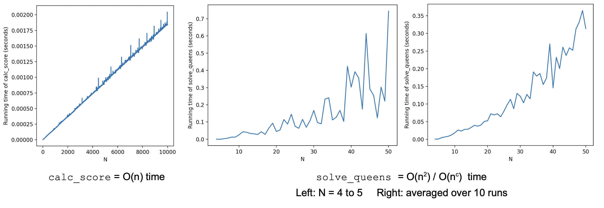

# n_queens

## Description

This repo contains a python script that finds a solution for the n-queens problem up to n = 80 (approximately) using local search and simulated annealing. This mini project is part of an assignment of the course COMP424 Artificial Intelligence in McGill University.

---

## Local search problem

### State space

A 1D python list queens of n integers with columns C and rows R. The Cth index with value R indicates a queen at column C and row R.

### Evaluation function

A function calc_score that outputs the number of attacked queens by checking the number of row and diagonal duplicates in the list. The algorithm attempts to minimize this score to 0.

### Moves

Each queen is allowed to move up or down along the board by a random number of squares constrained to the boundaries of the board (change its row value into a random value).

---

## Algorithm Description

`solve_queens(n):`

- Initialize `queens`, `MAX_ITER` for early stopping and `TEMP` for simulated annealing
- Loop for `MAX_ITER` number of times or until `min_score` reaches 0
- Move a random queen in a copied list to a different row value along its column
- If the score is lower than `min_score`, accept move and update `min_score` and `queens`
- Otherwise, accept move with probability dependent on the score difference and number of iterations: `e ** (score - min_score / (TEMP / (i+1)))`

### Time Complexity

### Issues with local optima

Solved, or at least minimized, with simulated annealing using TEMP = 1000. 0% failure rate over about 500 runs. Attempted TEMP values of 100, 200, 500 but search may get stuck in local optima in those values.
